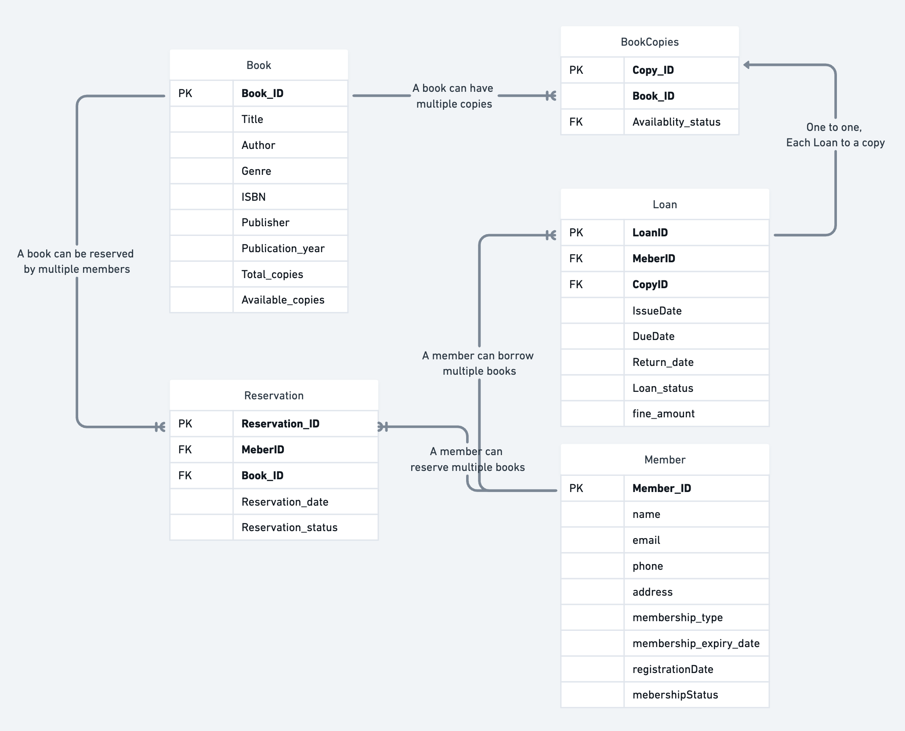

# Library Management system

## Step 1: Requirement Analalysis

Before Designing Indentify the key requirementss of LMS

1. Books
    - We will store datails of the book
    - Availablity of each book

2. Members
    - User information
    - Track Borrowing and overdue books
    - Membership detail

3. Loan Books
    - Record which member borrowed which book
    - Track issue date, due date, return date
    - History of loans (which user loaned the book)
    - Handle Overdue fines if book is not returned within the due date

4. Administrative Features
    - Add books
    - Registe New Members
    - Generate reports (overdue books, most borrowed books, newly added books, reserved books)
    - Get Books with different tags. genre/ subject/ topics/ author
    - Serach books

5. Reserve Book
    - Allow Members to reserve a books which is currently available
    - Reservation date
    - Status of reservation(Pending/ ready for pickup)

6. Multiple Copies of Books
    - Handle Multiple copies of same book
    - Each copy should have unique identifier
    - Track availablity of each copy independently
    - Allow Members to borrow any available copy of the books

## Step 2: Conceptual Design (ER Digram)




## Step 3: Logical Design

**Tables**

1. Book

```SQL
CREATE TABLE Book(
    Book_ID INT PRIMARY KEY,
    Title VARCHAR(255),
    Author VARCHAR(255),
    Genre VARCHAR(100),
    ISBN VARCHAR(20),
    Publisher VARCHAR(255),
    Publication_year INT,
    Total_copies INT,
    Available_copies INT
)
```

2. Member

```SQL
CREATE TABLE Member (
    MemberID INT PRIMARY KEY,
    Name VARCHAR(255),
    Email VARCHAR(255),
    Phone VARCHAR(15),
    Address VARCHAR(255),
    MembershipType VARCHAR(50),
    MembershipExpiryDate DATE,
    RegistrationDate DATE,
    MembershipStatus VARCHAR(20)
);
```

3. BookCopy

```SQL
CREATE TABLE BookCopy(
    Copy_ID INT PRIMARY KEY,
    Book_ID INT,
    Availability_status VARCHAR(20),
    FOREIGN KEY (Book_ID) REFERENCES Book(Book_ID)
);
```

4. Loan

```SQL
CREATE TABLE Loan(
    Loan_ID INT PRIMARY KEY,
    Member_ID INT,
    Copy_ID INT,
    Issue_date DATE,
    Due_date DATE,
    Return_date DATE,
    Loan_status VARCHAR(20),
    Fine_amount DECIMAL(10,2),
    FOREIGN KEY (Member_ID) REFERENCES Member(Member_ID),
    FOREIGN KEY (Copy_ID) REFERENCES BookCopy(Copy_ID)
);
```

5. Reservation

```SQL
CREATE TABLE Reservation(
    Reservation_ID INT PRIMARY KEY,
    Member_ID INT,
    Book_ID INT,
    Resrvation_date DATE,
    Reservation_status VARCHAR(20),
    FOREIGN KEY (Member_ID) REFERENCES Member(Member_ID),
    FOREIGN KEY (Book_ID) REFERENCES Book(Book_ID)
);
```

## Step 4: Physical Desing (Implementation)

- At this stage, you should implement the database using a DBMS Like MySQL.
- Consider Indexing, constraints, preformance Optimization


## Let's Write Some Queries and Understand it

1.