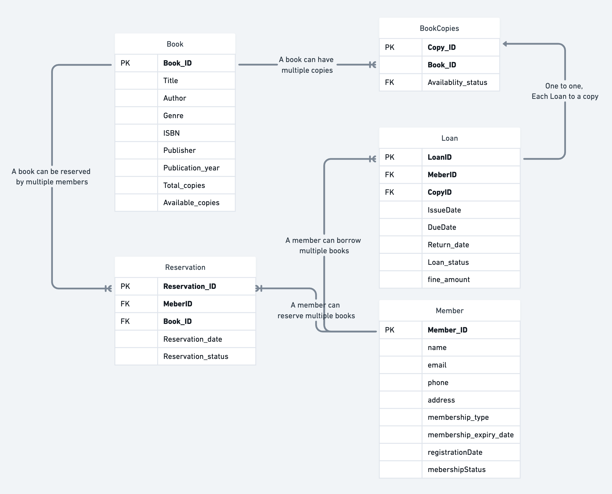

# Library Management system

## Step 1: Requirement Analalysis

Before Designing Indentify the key requirementss of LMS

1. Books
    - We will store datails of the book
    - Availablity of each book

2. Members
    - User information
    - Track Borrowing and overdue books
    - Membership detail

3. Loan Books
    - Record which member borrowed which book
    - Track issue date, due date, return date
    - History of loans (which user loaned the book)
    - Handle Overdue fines if book is not returned within the due date

4. Administrative Features
    - Add books
    - Registe New Members
    - Generate reports (overdue books, most borrowed books, newly added books, reserved books)
    - Get Books with different tags. genre/ subject/ topics/ author
    - Serach books

5. Reserve Book
    - Allow Members to reserve a books which is currently available
    - Reservation date
    - Status of reservation(Pending/ ready for pickup)

6. Multiple Copies of Books
    - Handle Multiple copies of same book
    - Each copy should have unique identifier
    - Track availablity of each copy independently
    - Allow Members to borrow any available copy of the books

## Step 2: Conceptual Design (ER Digram)




## Step 3: Logical Design

**Tables**

1. Book

```SQL
CREATE TABLE Book(
    Book_ID INT PRIMARY KEY,
    Title VARCHAR(255),
    Author VARCHAR(255),
    Genre VARCHAR(100),
    ISBN VARCHAR(20),
    Publisher VARCHAR(255),
    Publication_year INT,
    Total_copies INT,
    Available_copies INT
)
```

2. Member

```SQL
CREATE TABLE Member (
    MemberID INT PRIMARY KEY,
    Name VARCHAR(255),
    Email VARCHAR(255),
    Phone VARCHAR(15),
    Address VARCHAR(255),
    MembershipType VARCHAR(50),
    MembershipExpiryDate DATE,
    RegistrationDate DATE,
    MembershipStatus VARCHAR(20)
);
```

3. BookCopy

```SQL
CREATE TABLE BookCopy(
    Copy_ID INT PRIMARY KEY,
    Book_ID INT,
    Availability_status VARCHAR(20),
    FOREIGN KEY (Book_ID) REFERENCES Book(Book_ID)
);
```

4. Loan

```SQL
CREATE TABLE Loan(
    Loan_ID INT PRIMARY KEY,
    Member_ID INT,
    Copy_ID INT,
    Issue_date DATE,
    Due_date DATE,
    Return_date DATE,
    Loan_status VARCHAR(20),
    Fine_amount DECIMAL(10,2),
    FOREIGN KEY (Member_ID) REFERENCES Member(Member_ID),
    FOREIGN KEY (Copy_ID) REFERENCES BookCopy(Copy_ID)
);
```

5. Reservation

```SQL
CREATE TABLE Reservation(
    Reservation_ID INT PRIMARY KEY,
    Member_ID INT,
    Book_ID INT,
    Resrvation_date DATE,
    Reservation_status VARCHAR(20),
    FOREIGN KEY (Member_ID) REFERENCES Member(Member_ID),
    FOREIGN KEY (Book_ID) REFERENCES Book(Book_ID)
);
```

## Step 4: Physical Desing (Implementation)

- At this stage, you should implement the database using a DBMS Like MySQL.
- Consider Indexing, constraints, preformance Optimization


## Cosider Optimization

### Why Separate Tables for Genre and Author? 

1. **Normalization** : 

- By Creating Saparate table for Genre and Author, You ensure that each genre or author is stored only once, reducing redundancy and improving data integrity.

2. **Scalability** :

- If you want to add more attributes to genres or authors in the funture having saparate tables makes it easier to extend the schema without modifying the Book table.

3. **Flexiblity** :

- A book can have multiple authors or belong to multiple Genres. Using saparate tables allows you to implement many-to-many relationships between books and genres/authors

4. **Query Optimization** :

- Seraching for books by genre or author becomes more efficient when genres and author stored in their own tables. you van index these tables for faster lookups.


### Updated Schema

1. **Genre Table** :
- Thus table will store all unique genres

```SQL
CREATE TABLE Genre (
    Genre_ID INT PRIMARY KEY,
    Genre_name VARCHAR(100) NOT NULL UNIQUE
);
```

2. **Author Table** :
-     This table will store all unique authors.
     
```SQL
CREATE TABLE Author (
    Author_ID INT PRIMARY KEY,
    Author_name VARCHAR(255) NOT NULL UNIQUE
);
```

3. **Book Table** :
- The Book table no longer directly stores Author or Genre. Instead, we use junction tables to handle many-to-many relationships.

```SQL
CREATE TABLE Book (
    Book_ID INT PRIMARY KEY,
    Title VARCHAR(255),
    ISBN VARCHAR(20) UNIQUE,
    Publisher VARCHAR(255),
    Publication_year INT,
    Total_copies INT,
    Available_copies INT
);
```

4. **BookGenre Junction Table** :
- This table links books to genres (many-to-many relationship)

```SQL
CREATE TABLE BookGenre (
    Book_ID INT,
    Genre_ID INT,
    PRIMARY KEY (Book_ID, Genre_ID),
    FOREIGN KEY (Book_ID) REFERENCES Book(Book_ID),
    FOREIGN KEY (Genre_ID) REFERENCES Genre(Genre_ID)
);
```

5. **BookAuthor Junction Table**
- This table links books to authors (many-to-many relationship).

```SQL
CREATE TABLE BookAuthor (
    Book_ID INT,
    Author_ID INT,
    PRIMARY KEY (Book_ID, Author_ID),
    FOREIGN KEY (Book_ID) REFERENCES Book(Book_ID),
    FOREIGN KEY (Author_ID) REFERENCES Author(Author_ID)
);
```

6. **BookCopy Table** :
- No changes needed here.

```SQL
CREATE TABLE BookCopy (
    Copy_ID INT PRIMARY KEY,
    Book_ID INT,
    Availability_status VARCHAR(20),
    FOREIGN KEY (Book_ID) REFERENCES Book(Book_ID)
);
```

7. **Member Table** :
-     This table will store personal details of the member.
     
```SQl
CREATE TABLE Member (
    MemberID INT PRIMARY KEY,
    Name VARCHAR(255),
    Email VARCHAR(255) UNIQUE,
    Phone VARCHAR(15),
    Address VARCHAR(255),
    RegistrationDate DATE
);
```

8. **MembershipPlan Table**
- This table will store details about different membership plans.

```SQL
CREATE TABLE MembershipPlan (
    PlanID INT PRIMARY KEY,
    PlanName VARCHAR(100),
    Description TEXT,
    DurationInMonths INT,
    Price DECIMAL(10, 2)
);
```

9. **MembershipDetails Table** :
- This table links members to their membership plans and tracks subscription-specific information.

```SQL
CREATE TABLE MembershipDetails (
    Membership_ID INT PRIMARY KEY,
    Member_ID INT,
    Plan_ID INT,
    Subscription_start_date DATE,
    Subscription_expiry_date DATE,
    Membership_status VARCHAR(20), -- e.g., Active, Inactive, Expired
    FOREIGN KEY (Member_ID) REFERENCES Member(Member_ID),
    FOREIGN KEY (Plan_ID) REFERENCES MembershipPlan(Plan_ID)
);
```