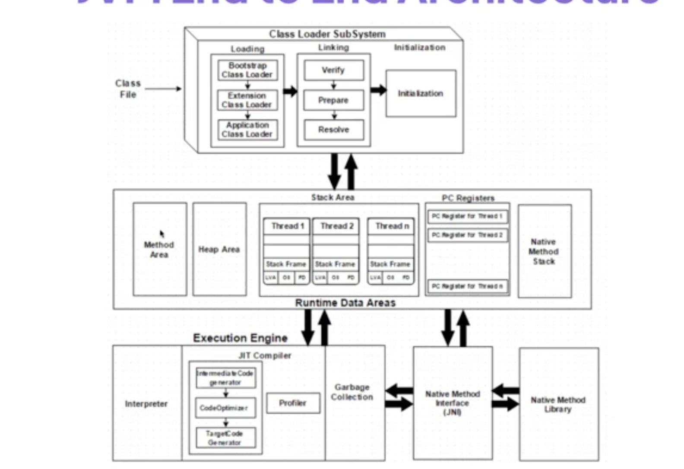
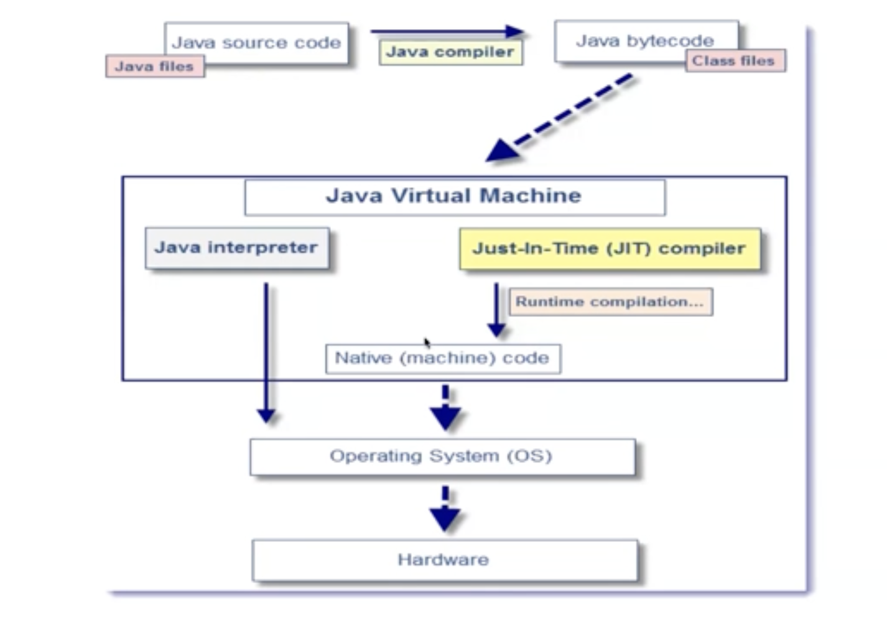

- Javac to compile Test.java to Test.class
- javap if you want to see the compiled output use javap -c Test
- java to run the java code java Test
- -verbose:class org.examples.Main
- jps -l
- jcmd 92467
- jcmd 94564 vm.classLoader
- what are the polular commands and how to get the internal detals of the running process

## JVM Components
1. Class Loader
    - Loading
        - Bootstrap Loader
        - Extention Class Loader
        - Application Class Loader
        - 
    - Linking
        - Verification
        - Preparation
        - Resolving
            - Load only the things you need
            - Lazy loading
    - Iniitalization
        - How a variable gets the memory and who does that
2. JVM Memory
    - Method Area
        - Meta Space
        - Compiled code is stored in method area?
    - Heap
        - Objects are stored in heap
        - Off Heap (Jit compiler stores the platform code)
        - On Heap
    - JVM Language Stack
        - Which line will be called
    - PC Registers
        - Stores the CPU Instruction
    - Native Methods Stacks
        - Stores the Native Methods
3. Execution Engine(Compile byte code to machine code)
    - Interpreters
    - Jit compiler
        - intermiate code generator
        - Code Optimizer
        - Target Code Generator
        - Profiler
    - Garbage collector

## Jit vs Interpreter
- Interpreter
    - Function : Executes java bytecode one instruction at a time
    - Performance : Slower execution due to repeatitive translation
    - Memory Usage : Lower memory usage; no storage of compiled code
    - Startup Time: Quick, No initial compilation Overhead
    - Use Case: Idea for quickly starting execution and handling rerely used code paths

- Jit Comoiler
     - Function : Compiles jabva bytecodes to native machine code at runtime
    - Performance : Faster execution after initial compilation; applies optimizations
    - Memory Usage : Higher memory usages; stores compiled machine code
    - Startup Time: Slower due to compilation overhead, but faster subsequent execution
    - Use Case: Best for frequently executed code paths(hot spot) for longer performance gain

## Oops

- What is Class?
- What is Object?

- Encapsulation

- Inheritance
- Polymorphism
