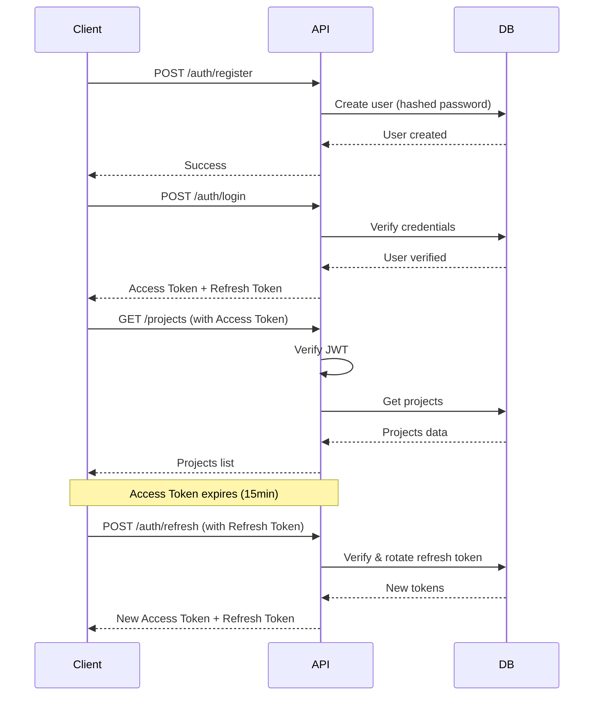

# File Management System API

> A complete VS Code-like file management system with authentication, multi-user support, and project-based file organization.

[](https://www.typescriptlang.org/)
[](https://nodejs.org/)
[](https://expressjs.com/)
[](https://www.mysql.com/)

---

## ✨ Features

- 🔐 **Complete Authentication System** - JWT with refresh token rotation
- 👥 **Multi-User Support** - Isolated workspaces for each user
- 📁 **Project Management** - Create and manage multiple projects
- 📝 **File Operations** - Full CRUD operations with search
- 📂 **Directory Management** - Create, move, copy, and organize folders
- 🔒 **Security First** - Path traversal prevention, input validation, role-based access
- 🚀 **Production Ready** - TypeScript, error handling, comprehensive documentation

---

## 🚀 Quick Start

### Prerequisites

- Node.js v14+
- MySQL v8+
- npm or yarn

### Installation

```bash
# Clone or navigate to project directory
cd fileMangementSystem

# Install dependencies
npm install

# Set up database
npm run setup-db

# Start development server
npm run dev:watch
```

Server will be running at `http://localhost:5050`

---

## 📚 Documentation

- **[Setup Guide](SETUP_GUIDE.md)** - Complete setup instructions
- **[API Documentation](API_DOCUMENTATION.md)** - Full API reference with examples
- **[Implementation Summary](IMPLEMENTATION_SUMMARY.md)** - Technical details and architecture
- **[Test Suite](test.http)** - REST Client test file

---

## 🎯 Key Endpoints

### Authentication
```bash
POST /auth/register  # Create account
POST /auth/login     # Get access & refresh tokens
POST /auth/refresh   # Refresh access token
GET  /auth/verify    # Verify token
POST /auth/logout    # Revoke refresh token
```

### Projects
```bash
POST   /projects      # Create project
GET    /projects      # List projects
GET    /projects/:id  # Get project details
GET    /projects/:id/tree  # Get file tree
PUT    /projects/:id  # Update project
DELETE /projects/:id  # Delete project
```

### Files (within projects)
```bash
GET    /projects/:id/files?path=...     # Read file
POST   /projects/:id/files              # Create file
PUT    /projects/:id/files              # Update file
DELETE /projects/:id/files?path=...     # Delete file
GET    /projects/:id/files/search?query=...  # Search files
```

### Directories (within projects)
```bash
GET    /projects/:id/directories?path=...  # List contents
POST   /projects/:id/directories           # Create directory
PUT    /projects/:id/directories/rename    # Rename directory
DELETE /projects/:id/directories?path=...  # Delete directory
```

---

## 🔐 Authentication Flow



---

## 🗂️ Project Structure

```
fileMangementSystem/
├── src/
│   ├── config/          # Configuration files
│   ├── controller/      # Request handlers
│   ├── middlewares/     # Auth, validation, logging
│   ├── routes/          # API routes
│   ├── services/        # Business logic
│   ├── types/           # TypeScript types
│   ├── utils/           # Helper functions
│   ├── scripts/         # Setup scripts
│   └── index.ts         # Main entry point
├── userFiles/           # User file storage (created on setup)
├── .env                 # Environment variables
├── package.json
└── tsconfig.json
```

---

## 💻 Example Usage

### 1. Register and Login

```bash
# Register
curl -X POST http://localhost:5050/auth/register \
  -H "Content-Type: application/json" \
  -d '{"name": "John Doe", "email": "john@example.com", "password": "password123"}'

# Login
curl -X POST http://localhost:5050/auth/login \
  -H "Content-Type: application/json" \
  -d '{"email": "john@example.com", "password": "password123"}'
```

### 2. Create a Project

```bash
curl -X POST http://localhost:5050/projects \
  -H "Content-Type: application/json" \
  -H "Authorization: Bearer YOUR_ACCESS_TOKEN" \
  -d '{"name": "my-app", "description": "My awesome app"}'
```

### 3. Create Files

```bash
# Create a file
curl -X POST http://localhost:5050/projects/1/files \
  -H "Content-Type: application/json" \
  -H "Authorization: Bearer YOUR_ACCESS_TOKEN" \
  -d '{"filePath": "index.js", "content": "console.log(\"Hello!\");"}'

# Create directory
curl -X POST http://localhost:5050/projects/1/directories \
  -H "Content-Type: application/json" \
  -H "Authorization: Bearer YOUR_ACCESS_TOKEN" \
  -d '{"path": "src"}'
```

### 4. Get File Tree

```bash
curl -X GET http://localhost:5050/projects/1/tree \
  -H "Authorization: Bearer YOUR_ACCESS_TOKEN"
```

---

## 🛡️ Security Features

| Feature | Implementation |
|---------|---------------|
| Authentication | JWT with RS256 |
| Password Storage | Argon2 hashing |
| Token Rotation | Automatic on refresh |
| Path Traversal | Validated and sanitized |
| SQL Injection | Prepared statements |
| XSS Prevention | Input sanitization |
| CORS | Configurable origins |
| Rate Limiting | Built-in middleware |
| File Size Limits | 10MB default |
| User Isolation | Filesystem + Database |

---

## 🧪 Testing

### Using REST Client (VS Code Extension)

1. Install REST Client extension
2. Open `test.http`
3. Update variables with your tokens
4. Click "Send Request" above each request

### Using cURL

See examples in [API_DOCUMENTATION.md](API_DOCUMENTATION.md)

---

## 📊 Database Schema

```sql
users
├── id (PK)
├── name
├── email (unique)
├── password_hash
├── roles (JSON)
├── token_version
└── timestamps

projects
├── id (PK)
├── user_id (FK → users)
├── name
├── description
├── file_path
└── timestamps

refresh_tokens
├── id (PK)
├── user_id (FK → users)
├── token_hash
├── user_agent
├── ip
├── expires_at
└── created_at

project_metadata
├── id (PK)
├── project_id (FK → projects, unique)
├── total_files
├── total_size
└── last_accessed
```

---

## ⚙️ Configuration

Create a `.env` file:

```env
# Database
DB_HOST=localhost
DB_USER=root
DB_PASSWORD=your_password
DB_NAME=file_management_system

# JWT Secrets (CHANGE IN PRODUCTION!)
JWT_ACCESS_SECRET=your_secret_key_here
JWT_ACCESS_EXP=15m
JWT_REFRESH_SECRET=your_refresh_secret_here
REFRESH_TOKEN_LENGTH=64
REFRESH_TOKEN_EXP_DAYS=30

# Server
PORT=5050
NODE_ENV=development

# File Storage
ROOT_STORAGE_PATH=./userFiles
MAX_FILE_SIZE=10485760
MAX_PROJECT_NAME_LENGTH=100
```

---

## 📦 Available Scripts

```bash
npm run dev          # Start development server
npm run dev:watch    # Start with hot reload
npm run build        # Build TypeScript
npm start            # Run production build
npm run setup-db     # Initialize database
npm run watch        # Watch TypeScript compilation
```

---

## 🚀 Deployment

### Production Checklist

- [ ] Change all JWT secrets in `.env`
- [ ] Set `NODE_ENV=production`
- [ ] Configure CORS for specific origins
- [ ] Set up database backups
- [ ] Enable HTTPS
- [ ] Set up monitoring and logging
- [ ] Configure rate limiting
- [ ] Review file size limits
- [ ] Set up automated backups

### Environment Variables for Production

```env
NODE_ENV=production
DB_HOST=your-db-host
DB_USER=your-db-user
DB_PASSWORD=your-secure-password
DB_NAME=production_db
JWT_ACCESS_SECRET=your-very-long-random-secret
JWT_REFRESH_SECRET=another-very-long-random-secret
PORT=5050
```

---

## 🤝 Contributing

This is a private project, but if you're extending it:

1. Follow TypeScript best practices
2. Add error handling for all operations
3. Update documentation for new features
4. Test all endpoints before committing

---

## 📝 API Response Format

### Success Response
```json
{
  "success": true,
  "data": {
    // Response data
  }
}
```

### Error Response
```json
{
  "success": false,
  "message": "Error description"
}
```

---

## 🔍 Troubleshooting

### Database Connection Error
```bash
# Check MySQL is running
mysql.server status

# Test connection
mysql -u root -p
```

### Port Already in Use
```bash
# Change PORT in .env or kill the process
lsof -ti:5050 | xargs kill -9
```

### Permission Errors
```bash
# Fix userFiles permissions
chmod -R 755 userFiles/
```

---

## 📈 Performance

- **Connection Pooling**: 10 concurrent connections
- **Async Operations**: All I/O is non-blocking
- **Indexed Queries**: Optimized database indexes
- **JWT Verification**: No database lookup for valid tokens
- **Efficient File Tree**: Recursive generation with caching potential

---

## 🎓 Learning Resources

- [TypeScript Documentation](https://www.typescriptlang.org/docs/)
- [Express.js Guide](https://expressjs.com/en/guide/routing.html)
- [JWT Best Practices](https://jwt.io/introduction)
- [MySQL Documentation](https://dev.mysql.com/doc/)

---

## 📄 License

ISC

---

## 👨‍💻 Author

Built with ❤️ for a complete file management solution

---

## 🎯 Roadmap

### Future Enhancements

- [ ] File sharing between users
- [ ] Real-time collaboration (WebSocket)
- [ ] File versioning system
- [ ] Trash/recycle bin
- [ ] Full-text search in files
- [ ] File preview generation
- [ ] Activity logs and audit trail
- [ ] Storage quotas per user
- [ ] Two-factor authentication
- [ ] API rate limiting per user

---

## ⭐ Features at a Glance

| Feature | Status |
|---------|--------|
| Authentication | ✅ Complete |
| User Management | ✅ Complete |
| Project Management | ✅ Complete |
| File Operations | ✅ Complete |
| Directory Operations | ✅ Complete |
| Search Functionality | ✅ Complete |
| Security Measures | ✅ Complete |
| API Documentation | ✅ Complete |
| Test Suite | ✅ Complete |
| Error Handling | ✅ Complete |

---

**🎉 Ready to use! Start building your file management application today!**

For detailed information, check out the [Setup Guide](SETUP_GUIDE.md) and [API Documentation](API_DOCUMENTATION.md).
