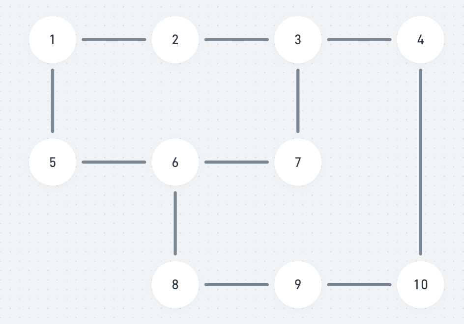
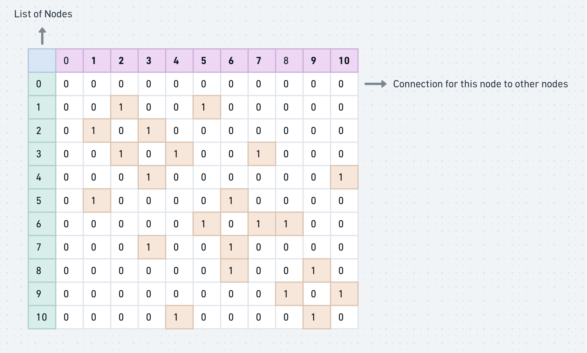

# Graph Representation

This graph can be represented in mainly two ways
1. Adjacency Matrix
2. Adjacency List

## Adjacency Matrix representation

We will create a 2D array of N x N

- Where N = number of node in graph

We will initially populate each cell with 0.

Mark 1 if if the intersection of those cell form an edge.

