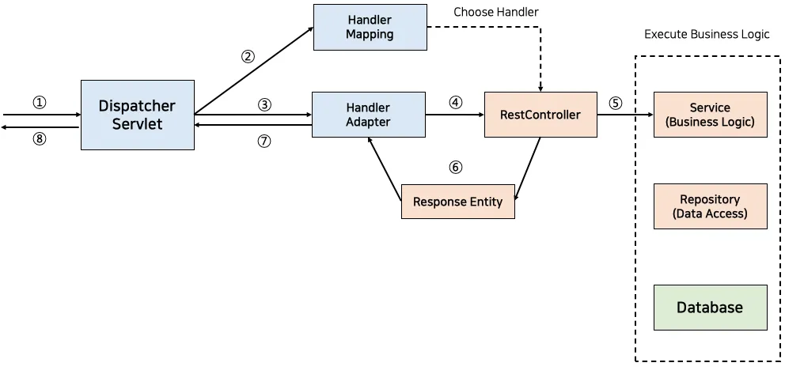

### **What is the DispatcherServlet?**

The `DispatcherServlet` is a core component of the Spring MVC framework. It acts as the **front controller** for handling HTTP requests in a Spring Boot application. As a front controller, it centralizes and manages the flow of incoming HTTP requests, routing them to the appropriate handlers (controllers) and returning the appropriate responses.

In simpler terms:
- The `DispatcherServlet` intercepts all incoming HTTP requests.
- It determines which controller method should handle the request based on the URL and HTTP method.
- It delegates the request processing to other components (e.g., controllers, filters, view resolvers).
- Finally, it sends the response back to the client.


### **How Does the DispatcherServlet Work?**

When an HTTP request is sent to a Spring Boot application, the following steps occur:

1. **Request Reception**:
   - The embedded web server (e.g., Tomcat) receives the HTTP request.
   - The request is passed to the `DispatcherServlet`.

2. **Handler Mapping**:
   - The `DispatcherServlet` consults the `HandlerMapping` to determine which controller method should handle the request.
   - The `HandlerMapping` uses annotations like `@RequestMapping`, `@GetMapping`, or `@PostMapping` to map the request URL to a specific method in a controller.

3. **Handler Execution**:
   - Once the handler (controller method) is identified, the `DispatcherServlet` invokes it.
   - If the handler requires additional processing (e.g., calling a service or repository), it delegates those tasks to other layers.

4. **View Resolution (Optional)**:
   - If the response involves rendering a view (e.g., Thymeleaf or JSP), the `DispatcherServlet` uses a `ViewResolver` to determine how to render the view.
   - For REST APIs, this step is skipped, and the response is directly serialized into JSON or XML.

5. **Response Construction**:
   - The `DispatcherServlet` constructs the HTTP response (status code, headers, body) based on the output of the controller method.

6. **Response Sending**:
   - The constructed response is sent back to the client via the web server.

---

### **Can You See the DispatcherServlet in a Spring Boot Application?**

Yes! The `DispatcherServlet` is automatically configured by Spring Boot when you include the `spring-boot-starter-web` dependency in your project. However, it operates behind the scenes, so you don't need to explicitly define it unless you want to customize its behavior.

Here’s how you can observe and interact with the `DispatcherServlet` in a Spring Boot application:

---

#### **1. Default Configuration**
Spring Boot automatically registers the `DispatcherServlet` for you. You can verify this by looking at the logs when you start your application. For example, you might see something like this in the console:

```
o.s.b.w.embedded.tomcat.TomcatWebServer  : Tomcat started on port(s): 8080 (http)
o.s.web.servlet.DispatcherServlet        : Initializing Servlet 'dispatcherServlet'
```

This indicates that the `DispatcherServlet` has been initialized and is ready to handle requests.

---

#### **2. Customizing the DispatcherServlet**
If you want to customize the `DispatcherServlet`, you can define it as a bean in your configuration class. Here’s an example:

```java
import org.springframework.boot.web.servlet.ServletRegistrationBean;
import org.springframework.context.annotation.Bean;
import org.springframework.context.annotation.Configuration;
import org.springframework.web.servlet.DispatcherServlet;

@Configuration
public class WebConfig {

    @Bean
    public ServletRegistrationBean<DispatcherServlet> dispatcherServlet() {
        DispatcherServlet dispatcherServlet = new DispatcherServlet();
        ServletRegistrationBean<DispatcherServlet> registrationBean = 
            new ServletRegistrationBean<>(dispatcherServlet, "/custom/*");
        registrationBean.setName("customDispatcherServlet");
        return registrationBean;
    }
}
```

In this example:
- A custom `DispatcherServlet` is registered to handle requests under the `/custom/*` path.
- This allows you to have multiple `DispatcherServlet` instances if needed.

---

#### **3. Debugging the DispatcherServlet**
To debug the `DispatcherServlet` and see how it processes requests, you can enable logging for Spring MVC. Add the following configuration to your `application.properties` file:

```properties
logging.level.org.springframework.web=DEBUG
logging.level.org.springframework.web.servlet.DispatcherServlet=DEBUG
```

This will log detailed information about how the `DispatcherServlet` handles requests, including:
- Which handler method is invoked.
- How the request is mapped.
- How the response is constructed.

Example log output:
```
DEBUG o.s.web.servlet.DispatcherServlet - GET "/user", parameters={}
DEBUG o.s.web.servlet.DispatcherServlet - Mapped to com.example.demo.UserController#getUser()
DEBUG o.s.web.servlet.DispatcherServlet - Completed 200 OK
```

---

#### **4. Accessing the DispatcherServlet Programmatically**
You can also access the `DispatcherServlet` programmatically in your application. For example:

```java
import org.springframework.beans.factory.annotation.Autowired;
import org.springframework.web.servlet.DispatcherServlet;
import org.springframework.stereotype.Component;

@Component
public class DispatcherServletInspector {

    @Autowired
    private DispatcherServlet dispatcherServlet;

    public void inspect() {
        System.out.println("DispatcherServlet initialized: " + dispatcherServlet);
    }
}
```

This demonstrates that the `DispatcherServlet` is a Spring-managed bean and can be injected wherever needed.

---

### **Key Components Managed by the DispatcherServlet**

The `DispatcherServlet` works with several helper components to process requests. These include:

1. **HandlerMapping**:
   - Maps incoming requests to handler methods in controllers.
   - Example: `RequestMappingHandlerMapping`.

2. **HandlerAdapter**:
   - Executes the handler method identified by the `HandlerMapping`.
   - Example: `RequestMappingHandlerAdapter`.

3. **ViewResolver**:
   - Resolves view names to actual views (e.g., Thymeleaf templates).
   - Not used for REST APIs.

4. **Exception Handlers**:
   - Handles exceptions thrown during request processing.
   - Example: `@ExceptionHandler` methods in controllers.

---

### **Conclusion**

The `DispatcherServlet` is a crucial part of any Spring Boot web application. While it operates behind the scenes, you can observe its behavior through logs, customize it if needed, and even access it programmatically. By understanding how it works, you gain deeper insight into the request-processing pipeline of your Spring Boot application.

If you want to explore further, you can:
- Enable debug logging to trace the flow of requests.
- Customize the `DispatcherServlet` to handle specific paths or behaviors.
- Use tools like Postman or curl to send requests and observe the responses.