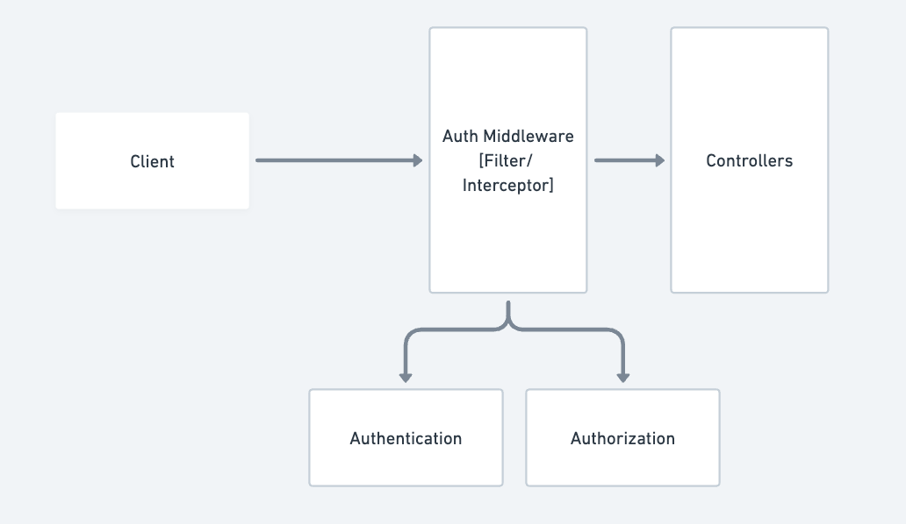
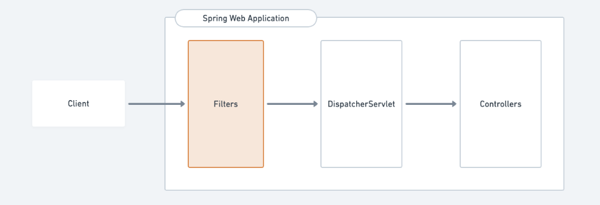
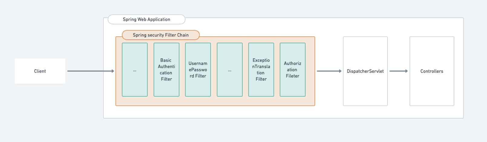
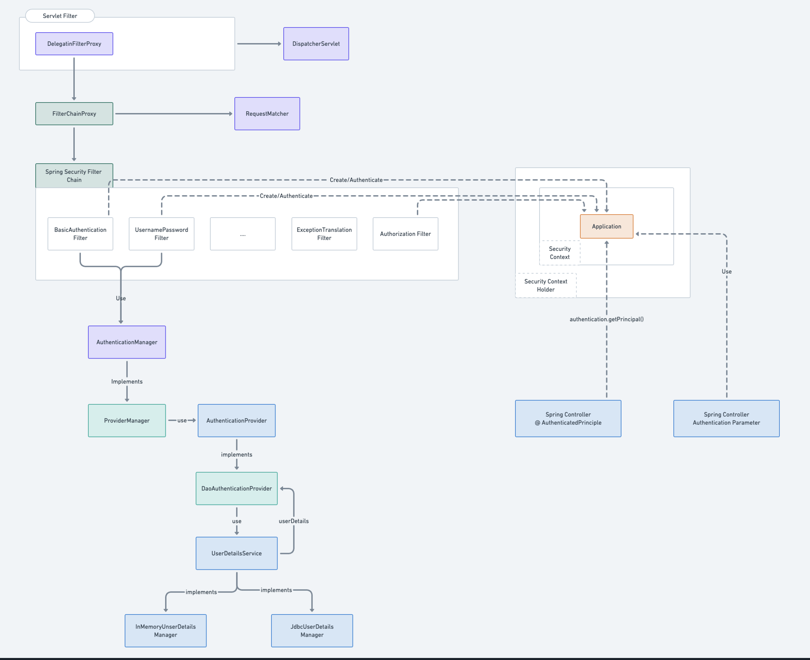

# How Security is Setup in Web Application?



```
[Server] -> [Middleware] -> [Endpoints]
```
Auth Logic is located in one place (middleware which is executed before the code that executes the business logic of any particular endpoint) and is not mixed with the business logic itself.

- **Authentication**: Security Mechanism to determine **WHO the user is** and it may involve loading data from DB,Cache, or getting user info from JWT. If User information is not sufficient then system typically denies the further processing of the request and return `status: 401(Unauthorized)`

- **Authorization**: The security mechanism checks WHAT action the user trying to perform and if use has the permission or Authority to do so. If particular action is not allowed to the user then system typically respond with `Status: 403(Forbidden)`


## How Security works in Spring?



```
[Servlet Container] -> [Filters] -> [Servlet]
```
In Java and Spring Web World (Servlet Based), the role of middleware is typically performed by **Filetrs** that are invoked before the Servlet. In case of Spring the servlet is known as **DispatcherServlet** which is the entry point for any request before it reaches to controllers.

In Reality, Many security related filers invoked one after the other, each performing it's part and passing the request forward.

```
[servlet container] -> [Filter] -> [Filter] -> .... ->[Filter] -> [Servlet]
```

- Spring security works in a similar way, it's fully based on filters(some part related to method-level authorization are handled by spring interceptors).



Default spring security filter chain consists of many filters, but they can be serving different purpose
- Authentication filters: Responsible for creation of authenticated object of the Authentication implememtation and setting it to securityContext.

- Authorization Filter: Responsible for deciding whether the user can perform certain action based on data in authentication.

- Other Filters: attack protection (CsrfFilters), Exception Mapping(ExceptionTranslationFilter)



This diagram represents the **Spring Security authentication flow architecture**, showing how requests are filtered, authenticated, and how user details are injected into the controller layer for application usage.

Let me break this down in phases for clarity:

---

### 🔁 1. **Request Entry (Servlet Filter)**
- **`DelegatingFilterProxy`**: Entry point for Spring Security via the servlet filter mechanism. It's registered in the `web.xml` (or auto-registered in Spring Boot).
- It delegates requests to **`FilterChainProxy`**, the actual filter chain for Spring Security.

---

### 🔒 2. **Spring Security Filter Chain**
- The `FilterChainProxy` contains the **Spring Security Filter Chain**—a series of filters that apply security logic.
  
#### Examples of filters involved:
- **BasicAuthenticationFilter**: Handles basic HTTP auth.
- **UsernamePasswordAuthenticationFilter**: Handles form-based login (username + password).
- **ExceptionTranslationFilter**: Handles authentication exceptions.
- **AuthorizationFilter**: Checks if the user has permission to access resources.

These filters create or validate the **`Authentication`** object from the request credentials.

---

### 🔐 3. **Authentication Process**
- The filters delegate authentication to the **`AuthenticationManager`**.
- **`AuthenticationManager`** is typically implemented by **`ProviderManager`**, which can manage multiple **`AuthenticationProvider`s**.
  
#### Provider Flow:
- **`AuthenticationProvider`** checks user details and credentials.
  - **`DaoAuthenticationProvider`** is the common implementation, which:
    - Uses a **`UserDetailsService`** to load user details (username, password, roles, etc.)
    - Compares the supplied credentials with the stored ones.

---

### 👤 4. **UserDetailsService Layer**
- Responsible for fetching user info from a data source.
  
#### Implementations:
- **InMemoryUserDetailsManager** – Stores users in-memory.
- **JdbcUserDetailsManager** – Loads users from a database with JDBC.

---

### 📲 5. **Authentication Result**
- If successful, the **Authentication** object is stored in the:
  - **`SecurityContext`**
  - Held by the **`SecurityContextHolder`**
- This authenticated context is now available throughout the request lifecycle.

---

### ✅ 6. **Authorized Request Handling**
- When the request reaches the **Spring MVC Controller**, we can access the authenticated principal via:
  - **`@AuthenticationPrincipal`** – for accessing user details directly.
  - **Authentication Parameter** – can get full `Authentication` object injected into controller method.

Example:
```java
@GetMapping("/profile")
public String profile(@AuthenticationPrincipal User user) {
    // user object from Spring Security context
}
```

---

### 📈 Summary:
This diagram outlines the full **authentication lifecycle in Spring Security**:

| Layer | Description |
|-------|-------------|
| Filters | Intercept HTTP requests to enforce security |
| `AuthenticationManager` | Delegates login/authentication tasks |
| `UserDetailsService` | Loads user data from memory or DB |
| `SecurityContextHolder` | Stores currently authenticated user |
| Controller | Uses injected user info for handling requests |


## Resources to Look For

1. [Spring Security Guide. Part 1: Introduction](https://medium.com/@ihor.polataiko/spring-security-guide-part-1-introduction-c2709ff1bd98)
