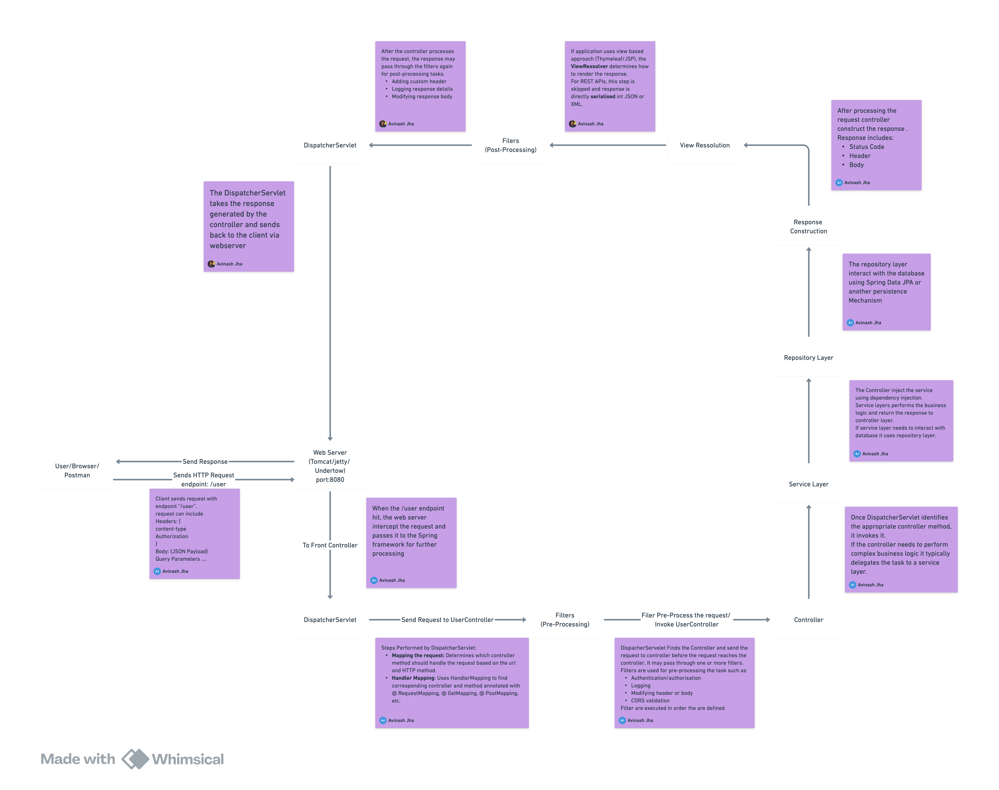

# What happens when you hit "/user/"

When you hit an API endpoint like `/user` in a Spring Boot application, the flow of the request involves several steps. Below is a detailed breakdown of the step-by-step process that occurs internally:



### **1. Client Sends the Request**
- The client (e.g., Postman, browser, or another service) sends an HTTP request to the `/user` endpoint.
- This request includes:
  - **HTTP Method**: GET, POST, PUT, DELETE, etc.
  - **Headers**: Metadata such as `Content-Type`, `Authorization`, etc.
  - **Body** (if applicable): Data sent with the request (e.g., JSON payload for POST/PUT requests).
  - **Query Parameters** (if applicable): Additional data appended to the URL (e.g., `/user?id=123`).

---

### **2. Web Server Receives the Request**
- The Spring Boot application runs on an embedded web server (e.g., Tomcat, Jetty, or Undertow).
- The web server listens for incoming HTTP requests on a specific port (default: 8080).
- When the `/user` endpoint is hit, the web server intercepts the request and passes it to the Spring framework for further processing.

---

### **3. DispatcherServlet Takes Over**
- The `DispatcherServlet` is the central component of Spring MVC and acts as the front controller.
- It receives all incoming HTTP requests and delegates them to appropriate handlers.
- Steps performed by `DispatcherServlet`:
  - **Mapping the Request**: Determines which controller method should handle the request based on the URL (`/user`) and HTTP method (GET, POST, etc.).
  - **Handler Mapping**: Uses `HandlerMapping` to find the corresponding controller and method annotated with `@RequestMapping`, `@GetMapping`, `@PostMapping`, etc.

---

### **4. Filters (Optional)**
- Before the request reaches the controller, it may pass through one or more **filters**.
- Filters are used for pre-processing tasks such as:
  - Authentication and authorization (e.g., checking JWT tokens).
  - Logging request details.
  - Modifying headers or body.
  - CORS validation.
- Filters are executed in the order they are defined in the application.

---

### **5. Controller Handles the Request**
- Once the `DispatcherServlet` identifies the appropriate controller method, it invokes it.
- Example of a controller:
  ```java
  @RestController
  @RequestMapping("/user")
  public class UserController {

      @GetMapping
      public ResponseEntity<User> getUser() {
          // Business logic to fetch user data
          User user = new User("John", "Doe");
          return ResponseEntity.ok(user);
      }
  }
  ```
- In this example:
  - The `@RestController` annotation indicates that this class handles REST API requests.
  - The `@GetMapping` annotation maps the `/user` endpoint to the `getUser()` method for HTTP GET requests.
  - The method processes the request, performs any necessary business logic, and returns a response.

---

### **6. Service Layer (Optional)**
- If the controller needs to perform complex business logic, it typically delegates the task to a **service layer**.
- Example:
  ```java
  @Service
  public class UserService {
      public User fetchUserDetails() {
          // Fetch user from database or other sources
          return new User("John", "Doe");
      }
  }
  ```
- The controller injects the service using dependency injection:
  ```java
  @Autowired
  private UserService userService;
  ```

---

### **7. Repository Layer (Optional)**
- If the service layer needs to interact with a database, it uses a **repository**.
- Example:
  ```java
  @Repository
  public interface UserRepository extends JpaRepository<User, Long> {
  }
  ```
- The repository interacts with the database using Spring Data JPA or another persistence mechanism.

---

### **8. Response Construction**
- After processing the request, the controller constructs the response.
- The response includes:
  - **Status Code**: HTTP status code (e.g., 200 OK, 404 Not Found, etc.).
  - **Headers**: Metadata such as `Content-Type`.
  - **Body**: Data to be sent back to the client (e.g., JSON representation of the user object).

---

### **9. View Resolution (Optional)**
- If the application uses a view-based approach (e.g., Thymeleaf, JSP), the `ViewResolver` determines how to render the response.
- For REST APIs, this step is skipped, and the response is directly serialized into JSON or XML.

---

### **10. Filters (Post-Processing)**
- After the controller processes the request, the response may pass through filters again for post-processing tasks such as:
  - Adding custom headers.
  - Logging response details.
  - Modifying the response body.

---

### **11. DispatcherServlet Sends the Response**
- The `DispatcherServlet` takes the response generated by the controller and sends it back to the client via the web server.

---

### **12. Client Receives the Response**
- The client receives the HTTP response, which includes:
  - **Status Code**: Indicates success or failure (e.g., 200, 404, 500).
  - **Headers**: Metadata about the response.
  - **Body**: The actual data returned by the API (e.g., JSON payload).

---

### **Summary of the Flow**
1. Client sends HTTP request to `/user`.
2. Web server intercepts the request and passes it to `DispatcherServlet`.
3. Filters (if any) preprocess the request.
4. `DispatcherServlet` maps the request to the appropriate controller method.
5. Controller processes the request, optionally delegating to service and repository layers.
6. Response is constructed and passed back to `DispatcherServlet`.
7. Filters (if any) post-process the response.
8. `DispatcherServlet` sends the response back to the client.

This modular architecture ensures that each component has a clear responsibility, making the application scalable and maintainable.

Resource:
1. [The DispatcherServlet: The Engine of Request Handling in Spring Boot](https://medium.com/@lakshyachampion/the-dispatcherservlet-the-engine-of-request-handling-in-spring-boot-3a85c2bdbe6b)

2. [An Intro to the Spring DispatcherServlet](https://www.baeldung.com/spring-dispatcherservlet)